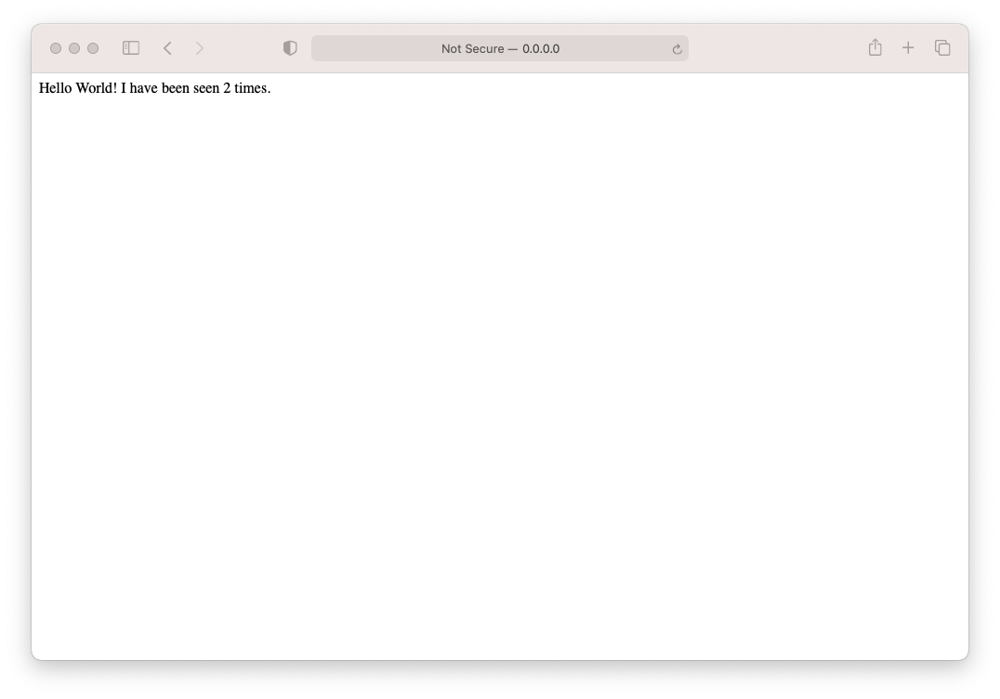

# Docker Copose example

Simple example from the Docker docs on [getting started with Docker Compose](https://docs.docker.com/compose/gettingstarted/).


## Use

```bash
docker compose up
```

You should now be able to open [http://localhost:5000](http://localhost:5000) and see the following:


